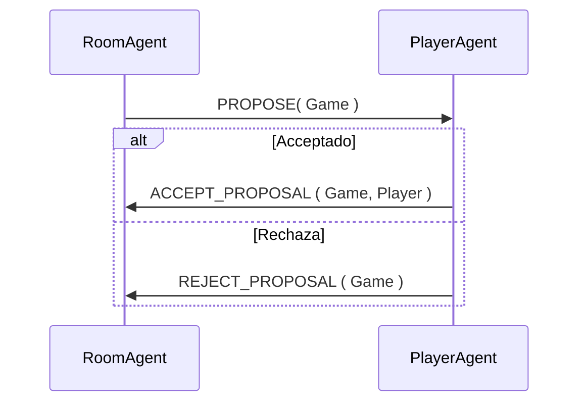
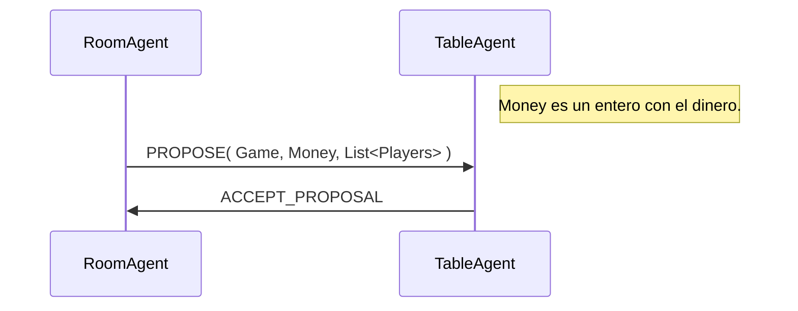
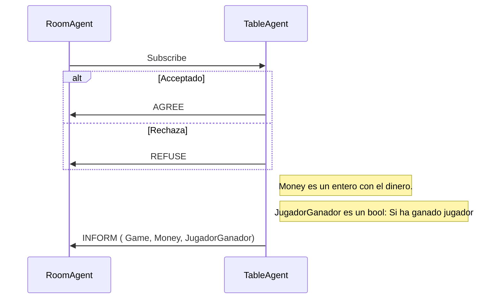
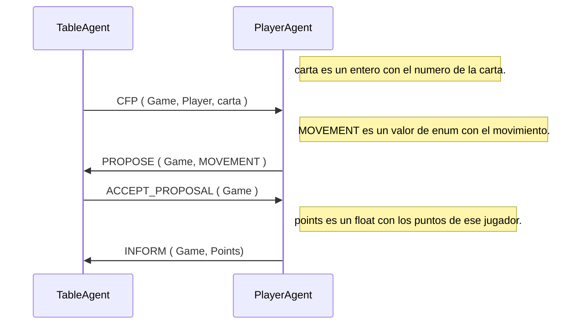
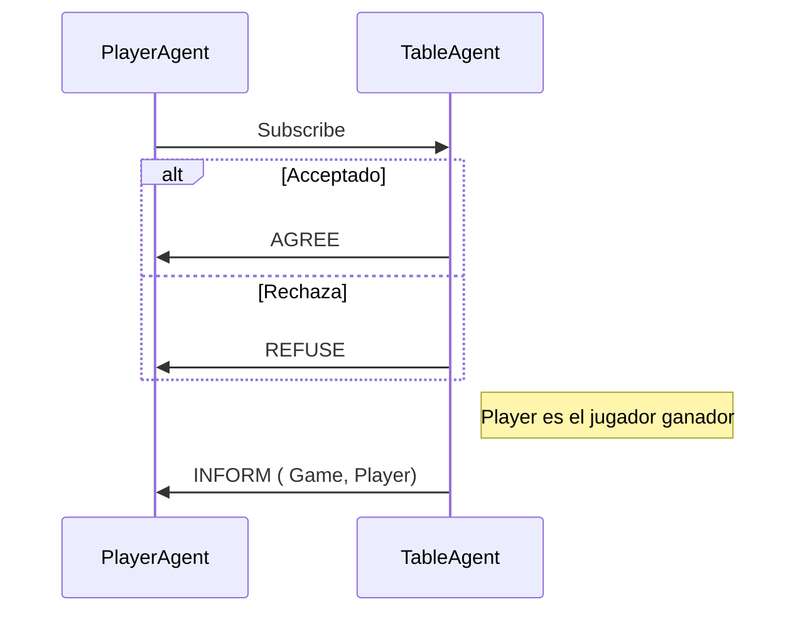

## Juego de las siete y media

### Diseño de los protocolos de comunicación

Para la comunicación entre los distintos agentes del juego se han configurado los siguientes protocolos para adaptar la comunicación.

#### HandleSearchPlayers
Este protocolo implementa el protocolo de comunicación **Propose** entre la sala y el jugador, siendo la sala el iniciador y el jugador el participante. Envía las proposiciones a los jugadores y recoge sus respuestas y las trata, de forma que si hay suficientes jugadores para la misma partida genera una mesa con esos jugadores y reserva el dinero para esa mesa teniendo en cuenta el doble del jugador que más haya apostado. Se crea mesa si la sala cuenta con dinero para pagar la apuesta de todos los jugadores, sino se cancela la partida.

#### HandleDevelopGame

Este protocolo se encarga de enviar a la mesa creada los datos de la partida que se desarrolla en esa mesa y jugadores de la partida. implementa el protocolo **Propose** donde el iniciador es la sala y el participante la mesa. Se llama al protocolo una vez que se termine de tratar los mensajes de la partida desde una tarea OneShot que genere el mensaje con los datos para enviar a la mesa. Se realiza siempre que haya una mesa a la que enviar los datos. 

 #### HandleSubscribeForTable

Este protocolo genera una subscripción para la mesa, para recibir los resultados de esta una vez que finaliza la partida que se ha llevado a cabo en esa mesa. Implementa el protocolo **Subscribe** donde el iniciador es la sala y el participante es la mesa. Se llama al protocolo una vez que se ha creado la mesa para la partida.

#### HandleCompleteRound

Este protocolo se usa para ir mandando los movimientos de cada jugador en su turno. Implementa el protocolo **Contract-Net** donde el iniciador es la Mesa y el participante es el Jugador. Se llama una vez que se tienen los datos de los jugadores de la partida. Lo que hace es enviar una carta cada vez y recibe un movimiento del jugador, GET_CARD, REFUSE, OUT, NO_TURN, y en función de la respuesta se pasa al siguiente jugador o no. El inform actualiza los datos de puntuación del jugador en cada momento de la partida.

#### HandleFinishGame

Este protocolo permite la comunicación entre la mesa y el jugador del resultado de la partida una vez que esta finaliza. Implementa el protocolo **Subscribe**, en el que el jugador es el iniciador y la mesa es el participante. 

### Tareas implementadas

Esta es una descripción de lo que hace cada tarea de cada agente, cuando se llama y a que protocolos llama para el desarrollo del juego. 

#### RoomAgent

---

##### TaskSubscriptionDF 

Esta tarea permite registrar a los agentes, jugadores, y consolas que se hayan registrado para envio de mensajes.

##### TaskSendConsole

Esta tarea permite enviar a consola los mensajes que se necesiten mostrar al usuario.

##### TaskSearchPlayers

Esta tarea se ejecuta cada x tiempo y lo que hace es que genera una partida simple o doble, si hay mesas disponibles de ese tipo, se crea un Game y usando el protocolo HandleSearchaPlayers se envia a los jugadores. Esta tarea se ejecuta en cuanto se recibe los datos de la interfaz.

##### TaskDevelopGame

Esta tarea es de tipo One Shot y permite enviar los datos de la partida y jugadores a la mesa una vez que esta esta creada. Lo que hace es generar el mensaje con la partida, dinero y jugadores y llama al HandleDevelopGame, que lo comunica con el protocolo Propose. Se llama cuando se ha creado la mesa correspondiente.

#### TableAgent

---

##### TaskSubscriptionDF

Permite buscar agentes consola para comunicar el proceso de juego.

##### TaskGame

Implementa cada movimiento del jugador en la partida. Usa Behaviour, de forma que se ejecuta ciclicamente hasta que el turno de cada jugador haya terminado. Lo que se hace es que con una condición, que incluye que se haga el el siguiente movimiento, y que la ronda actual no sea la ultima, se genera una carta aleatoria de un mazo que se inicializa en el setup del agente y crea el mensaje para enviar el protocolo HandleCompleteRound (Contract-Net) y este se encarga de recoger el movimiento. en función de lo recogido se aumenta el turno o no y se habilita el siguiente movimiento por lo que se puede lanzar otro contract-net con otro movimiento. Una vez que todos los jugadores han terminado y es el ultimo turno, se devuelve true en el método done.

##### TaskFinishGame

Tarea One Shot que finaliza el juego, lo que g¡hace es que realiza el juego de la banca una vez que los jugadores terminan. Por esto se llama en el método done de la tarea anterior una vez que vaya a devolver true. Tambien calula que jugador esta mas cerca de las 7.5 sin pasarse y si este tiene una puntuación mayor que la banca, gana, sino gana la banca.

##### TaskSendRoom

Esta tarea One Shot se encarga de notificar a la sala los resultados mediante el método notify de la subscripción a la sala. Se llama una vez que termina la tarea FinishGame.

##### TaskSendConsole

Se encarga de enviar a consola los mensajes

#### PlayerAgent
---

##### TaskCheckGame

Tarea ciclica que comprueba si ha pasado un tiempo entre la recepción de la partida y la recepción del turno de juego. Si se ha cumplido un tiempo, se elimina y se restaura el dinero. Se añade en cuanto comienza la ejecución del agente.

### Clases auxiliares

La clase **Game** es la partida a enviar, que contiene la id de la partida, la ronda actual y el tipo de apuesta. 

La clase **Player** tiene el nombre del jugador, los puntos actuales conseguidos por el jugador y datos del jugador (Player Data).

La clase **PlayerData** contiene una instancia de Game y el dinero que el jugador apuesta en esa partida.

La clase **Subscriptions** es el gestor de subscripciones para los que implementan el protocolo Subscribe como participante.

